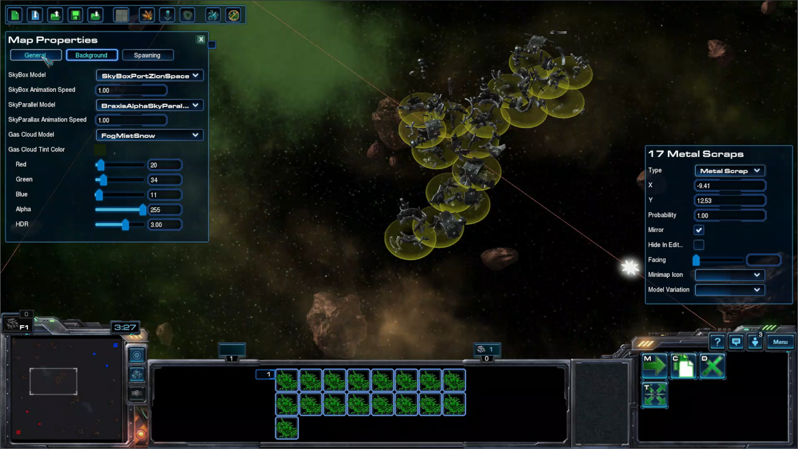

# [v5.0] - 2025-XX-XX - R1

## WIP stage

**This is a Work In Progress - might not be playable at the moment.**

- Tourney rewards & donator skins - "gone" (past and future). Due to disturbances related to publishing (currently not able to use my original account), I had to change setup of this stuff.. The plan is to automate it (at least in partially).
- Most recent tourney from 2025-04 is going to be tied to new system (with website integration - for historical purposes). Until this is completed as a whole rewards will not kick in, sorry!
- Banks disabled & Ship restrictions disabled (until process of restoring game progression is refined - which is as soon as I put the website up)

> Issues listed above are considered to be of high importance, yet they've been historically problematic enough when it comes to updating/maintaining it.. that I'm intending to deal with this once and for all (hopefully!).
> 
> Another factor being is that is a "test map", that needs to be published from another account. And I don't expect to be able to publish from my original account for a longer while (my estimation would be months to infinity). Hence a long term solution is desired here.
>
> This "test map" might be a several weeks process.. I'm not sure if I'll wrap this up this year. Might have to cut some planned features/work.. we'll see...

## Map editor

- [x] done / resurrected (not refined).

- [map editor trial run on YouTube](https://www.youtube.com/watch?v=wO1D8iv6iFw)

> TODO: what/where/how screenshots screen, short YT video etc. (expand on the docs later once the website is up)

## Ships & balance

- Queen reintroduced.

> Queen still requires more thought, not just testing. Abilities such as:
> - Symbiote 
> - Infestation
>
> Aren't considered to be complete - likely still flawed on both angles. But hopefully good enough to postpone
>
> Other avenues are "done" on the design aspect, but the exact way of implementation leaves a lot of room for improvements/changes.
>
> "Done" means I hope it's good enough for now, but I bet this is not a final iteration and I expect it might require a lot of revisions before things are in place.

### Queen

- Added missing blood FX when ship is crit/heavy/light damaged.
- Added first set of achievements for playing Queen ("Casual Play" category).
- Neural Parasite:
  - It's now a projectile driven ability - it needs time to arrive at the impact point.
  - Affected ships now require extra 2s for effect to complete, and fight for the Queen.
  - Affected ships can no longer use the shield.
    > This is mostly aimed at upgraded Carrier's interceptors (with constant shield regeneration).
  - Duration increased from 20s to 25s.
  - Improved interactions with following units:
    - Interceptors can be box-selected.
    - Scourges will no longer suicide, instead they'll turn back, attacking nearest capital ship they'll see unfriendly.
    - Siege fighters & Broodlords will initially waypoint back to the other base.
    - Observer & spotter will initially follow the Queen.
    - Other units will initially a-move to the Queen.
- Infestation:
  - Can now be casted on non mechanical units - all zerg capital ships, including Queen itself.
  - [x] infestation cooldown ultimate 30s -> 45s
  - [ ] `InfestationLaunchMissile` should not validate vision upon launch of tentacle
- Blinding Cloud:
  - It's now larger, and no longer a perfect circle, but an oval, that stretches to the sides in relation to the direction it was thrown.
  - It no longer limits the vision of the ships that are inside, but also blocks the line of sight of the approaching ships, similarly as Gas Clouds do.
- Parasitic Bomb:
  - Reduced damage vs. Massive from 1350 to 1200
  - Removed target acquisition in response to the Parasitic Bomb damage, that would draw aggression to the Queen, from affected units and the ones which were nearby (in response to `CallForHelp`).
- Ensnare:
  - Upon impact effect stays on the battlefield for 1s before expiring (akin to Arbiter's storm), instead of one-time hit-scan like behavior.
- Fixed an issue where Blinding Cloud effect would persist, if player's ship was killed while cloud's effect was still active.
- Fixed an issue where Blinding Cloud wouldn't de-buff Overlord's Antennae.
- Fixed an issue where Infestation would not be immune to Dreadnought's Cover.
- Fixed an issue where Infestation wouldn't correctly mark player's ship as killed, by a result game couldn't be won until enemy base has been destroyed.
- Fixed an issue where Infested ship wouldn't have its minimap icon.

### Battlecruiser

- Fixed Lockdown to no longer disable ability to launch & retarget OBF and Escort Fighters (Carrier's Scouts).

### Dreadnought

- Fixed an issue where Cover could repeatedly attempting to redirect the same projectile. Combined with the slow down of speed for first ~0.5 second upon redirect, it could cause weird glitches, especially noticeable with chasing projectiles (i.e. Raven's Seeker, BC's Nuke).
- Fixed an issue where Cover would remain active when trapped in Arbiter's Stasis Field.

### Frigate

- Fixed range upgrade to actually increase launch/retarget of wraiths per `1.25` per level (instead of `1`), as it was intended and written in the tooltip.
- Fixed inaccurate tooltip on Wraith upgrade mentioning increased damage by `+0.5` to massive, where it was actually `+1`.

### VoidRay

> - Yes nova is "broken" I know.
> - There's a draft for of balance update from OG. And this most likely more less what will be implemented once I deal with other stuff :)

### Misc balance

- `AcquireLeashRadius` 21 -> 18
- `AcquireLeashResetRadius` 5 -> 7
- `AcquireMovementLimit` 21 -> 18
- `CallForHelpRadius` 2 -> 4
- `CallForHelpPeriod` 2 -> 4

> ^ Queen related

## Bugfixes

- Fixed lack of spacing between teams on the leader board.
- Fixed an issue where if match completed prematurely ("You won the game." message at the end - without any points), it would count as a loss for the victorious team.
- Fixed an issue where changed settings (UI config, ship skins etc.) wouldn't be immediately saved into bank file (it required completing rated game, or changing settings prior to picking a ship).
- Fixed an issue where `Team Side` option in lobby settings wouldn't apply. (Or rather, it was only being considered in games where teams were automatically balanced - so completely opposite from how it was intended).
- Fixed na issue where `Map` chosen in lobby settings wouldn't align with what the game actually used. 
  > The list presented in lobby was off by 1 element, so when you were picking `C`, the game was loading `B` etc. - in that order, with the exception of "Ulnar" - it was the only one that did align.
- Fixed a rare issue related to "Squads" - in some scenarios (reaching 15 players within the lobby at least once during its lifetime + some other edge case criteria) the game would fail to initialize completely - no bases, no ships.
- Fixed an issue where rating of the teams wasn't calculated in games that used `Premade / IH` mode, and had teams preset in lobby (no FFA). Resulting in `+16 / -16`. (It was working correctly only when teams were balanced automatically by in-game systems).
  > Really surprised we caught it just now. Also, please double check if it was indeed fixed, as it was kind of a blind fix.

## UI

### Match summary

- post game stats
- WIP (ofc!) - might actually scrap this, and move this as a part of website - SC2Replay analysis.

### Team overview

- WIP (ofc!)

---

### TODO

- [ ] OG BU https://starbattlereloaded.freeforums.net/thread/2/v4-9-wip
